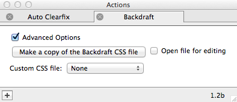

# Using Custom CSS
----

While much responsive functionality can be achieved natively in Freeway now, you may still find yourself in scenarios where you need to hand-code some responsive CSS. Backdraft makes this easy with a built-in action!

----

## Steps

1. In the menu bar, go to **Page > Page actions** and choose **Backdraft**.

2. Open the actions palette and check **Advanced Settings**. 

3. Click **Make a copy of the Backdraft CSS file**. This will open up a dialog allowing you to choose where you want to save your custom copy of Backdraft's CSS. We recommend you use the `Media` folder that Freeway created with your Backdraft document.

    <aside markdown="1">
    Pro tip: By selecting **Open file for editing**, it will immediately open the resulting CSS file in your default editor, ready for customization.
    </aside>

4. Click **Save**, then open the resulting CSS file in your favorite editor. It's already configured with the default Backdraft breakpoints and some small bits of additional CSS that Backdraft uses (don't remove it unless you know what you are doing).

5. Save the new version the the CSS file and preview the website. Your changes to the page should now be applied!
