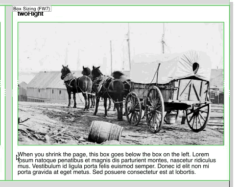
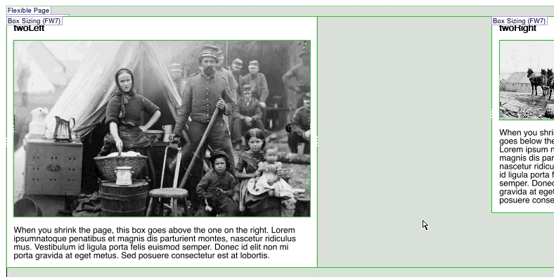

# Customizing the Modules

One of the basic premises of Backdraft is that it will let you design, while it helps with the construction. A large part of designing whilst using Backdraft is tied up in customizing the appearance of the modules. In this article, we will talk about customizing colors and sizes of columns.

----

## Changing Colors

Changing colors of modules in Backdraft is easy. Simply click around on a module until you find the element that is colored "contentBackground" (check the inspector), then change it!

Alternately, if you want to change the background color of *all* the modules across the template, you can modify the "contentBackground" color. In Freeway, go to **Edit > Colors**. Select the **contentBackground** color, and click **Edit**. Modify to taste!

## Customizing Column Size

Customizing the width of the columns of the framework and alternate framework modules is equally simple. In this example, we'll be modifying the two column module so we have a larger "content area" to the left, and a sidebar on the right.

1. Grab the left drag-handle of the right column and drag it to the right.

	

2. Now, grab the right drag-handle of the left column and drag it to the right.

	
