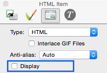

# Hiding/Showing Elements at Different Breakpoints
----

Hiding or showing elements at certain breakpoints is easy in Freeway 7 by using a little bit of CSS in the extended dialog.

----

## Steps

1. Determine what breakpoints you want to hide the element on.

2. Go to the largest of those breakpoints in Freeway. By default, any changes that you make in a breakpoint will apply to any smaller breakpoints unless it's overridden.

3. Click on the element and open the inspector.

4. Go to the **Item Output Settings** pane of the inspector, and uncheck **display**.
	

5. If you want the item to unhidden at a smaller breakpoint, switch to that breakpoint and repeat steps 3 and 4, but this time check the box. If you have trouble selecting the element, use Freeway's sidebar.
