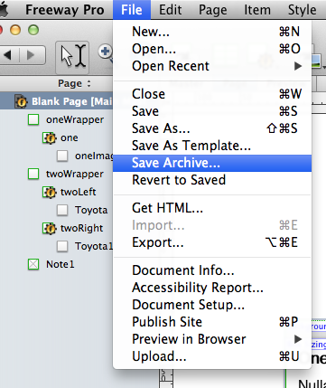

# Sending Your Freeway Site

Oftentimes, I may want to take a peek at your Freeway file to assist with troubleshooting. Creating an archive and sending that to me is the most foolproof method.

---

## Steps

1. In Freeway, go to "File > Save Archive…"

2. Follow the resulting dialogs and save it to your hard drive.

3. Right-click on the folder that Freeway created in Finder, and choose 'Compress "Folder Name"'. This will create a zip file.

4. Upload the zip using a cloud service like Walter Davis' [Fling](http://fling.walterdavisstudio.com). Set the expiration to three days.

5. Send the link to <caleb@onrampwebdesign.com>.
