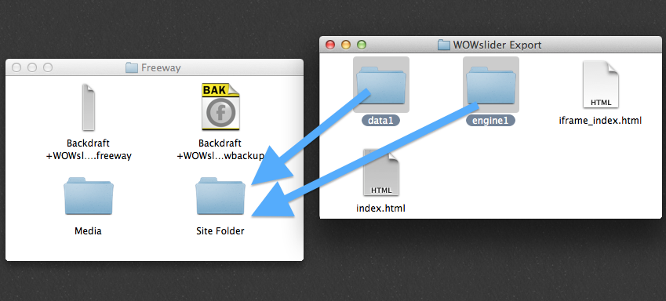

# Using WOW Slider With Backdraft
----

WOW Slider is currently the easiest way to create flexible-width sliders and carousels for Backdraft. Using it is fairly straightforward and easy.

---

## Steps

1. In WOW Slider, set the document to use the correct width. This is calculated by finding the width of the container element in backdraft, and subtracting the left and right margin. For the single column wrapper with default padding of 14px, that calculates to 1172px. This is set in the image tab of the gallery properties menu (wrench icon). Set the height to whatever you want.

2. Publish from WOW Slider to a local folder. Copy the resulting `data` and `engine` folders to the `Site Folder` that Backdraft creates. You will still have to upload the two folders to your server manually, but this allows the local preview to work.

3. Open the `index.html` file that WOW Slider exported with your favorite code editor. First, copy the code wrapped in `<!-- Start WOWSlider.com HEAD section -->` and `<!-- End WOWSlider.com HEAD section -->` to your clipboard.

4. Open the document in Freeway, go to the page that the slider will be displayed on, and in the menu bar navigate to `Page > Insert HTML`. Choose `Before </head>` in the dialog, and paste the code in.

5. Return to the index.html file, and this time copy the code between `<!-- Start WOWSlider.com BODY section -->` and `<!-- End WOWSlider.com BODY section -->` to your clipboard.

6. In Freeway, insert an inline instance of the Crowbar action where you want the slider to appear. In the actions palette click on the `Code` button. Paste the markup into the prompt and click `OK`.

7. Test it!
